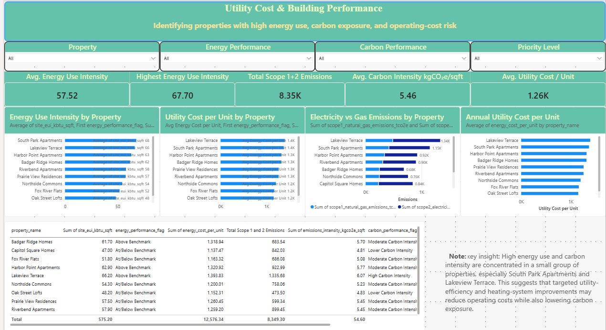
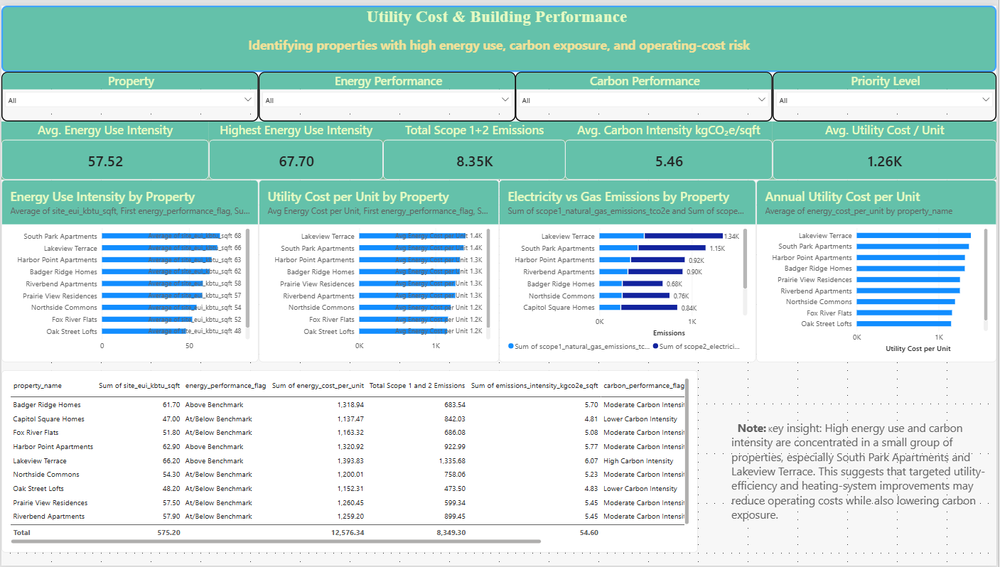
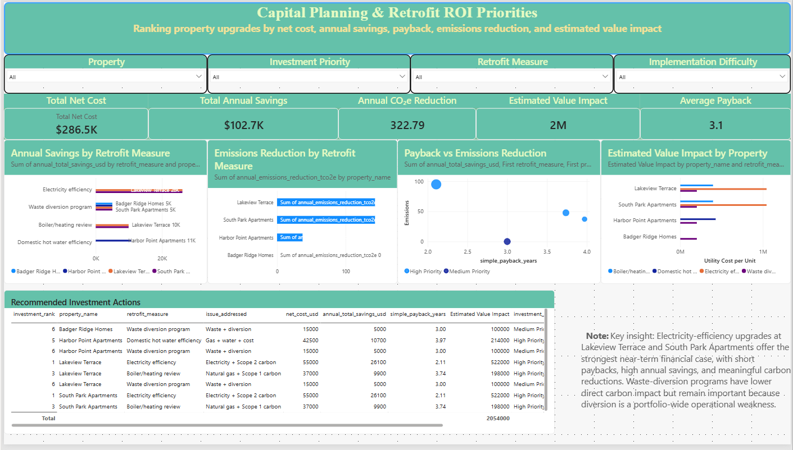

# Multifamily Portfolio Cost, Risk & Retrofit ROI Dashboard

A Power BI and Excel dashboard that connects property performance, utility cost, operating risk, and retrofit ROI to support capital-planning decisions for multifamily real estate portfolios.

## Project Overview

This project was done to show how building-performance data can be applied for more than reporting. In many real estate projects, utility bills, asset information, sustainability metrics, and capital-improvement ideas are stored separately. That makes it difficult for property managers and asset owners to see which buildings need attention first and which upgrades are financially worth considering.

This dashboard brings those pieces together in one decision-support workflow. It utlized a simulated multifamily portfolio to evaluate energy use, utility cost, emissions exposure, waste efficiency, and retrofit financial performance. The goal is to help identify properties with higher operating-cost risk and connect those findings to practical investment decisions.

The project is not designed to produce an official ESG score. Instead, it demonstrates how sustainability-related data can be translated into the language of property management: cost, risk, payback, asset value, and capital planning.

## Business Use Case

Property managers and asset owners often need to answer practical questions before deciding where to spend time or capital:

- Which properties are costing more to operate?
- Which buildings show signs of higher utility or performance risk?
- Which assets should be reviewed first for energy or operational improvements?
- Which retrofit measures have the strongest payback?
- How could annual savings affect estimated property value?
- Where do operating-cost reduction and sustainability benefits overlap?

This project shows one way to organize those questions into a dashboard that is useful for both operational teams and sustainability teams.

## Dashboard Pages

### 1. Portfolio Performance & Risk Overview

This page identifies which properties should receive attention first. It combines energy, water, waste, carbon, diversion, and data-coverage indicators into an internal priority score.

The purpose is not to label one building as “good” or “bad,” but to help managers see where multiple issues overlap. A property with above-benchmark energy use, high carbon intensity, weak waste diversion, and higher operating costs should rise to the top of the review list.

### 2. Utility Performance & Operating Cost Risk

This page focuses on the connection between utility performance and operating cost. It compares energy use intensity, utility cost per unit, carbon intensity, and electricity versus natural gas emissions across the portfolio.

For property managers, this page helps translate technical metrics into operating concerns. A building with high energy use intensity may also have higher utility costs, resident affordability implications, or future capital needs.

### 3. Capital Planning & Retrofit ROI Priorities

This page connects building-performance issues to potential retrofit actions. Measures are compared by net cost, annual savings, simple payback, emissions reduction, and estimated value impact.

This page is especially useful for capital planning because it helps separate actions that are operationally important from actions that also have a strong financial case. For example, an electricity-efficiency upgrade may reduce operating costs and emissions at the same time, while a waste-diversion program may have lower direct financial return but still address a portfolio-wide operational weakness.

## Key Metrics

- Energy use intensity
- Utility cost per unit
- Scope 1 and Scope 2 emissions
- Carbon intensity
- Waste diversion rate
- Water and waste performance indicators
- Integrated property priority score
- Retrofit net cost
- Annual savings
- Simple payback
- Cost per tCO₂e reduced
- Estimated value impact

## Methodology

The project uses a layered workflow:

1. **Input data organization**  
   Asset-level information, utility data, emissions factors, benchmark assumptions, and retrofit options are organized in Excel.

2. **Performance calculations**  
   The workbook calculates energy use intensity, utility cost per unit, water intensity, waste diversion, Scope 1 and Scope 2 emissions, and carbon intensity.

3. **Integrated prioritization**  
   Properties are ranked using an internal screening method that combines operating performance, utility use, waste diversion, carbon exposure, and data-readiness indicators.

4. **Retrofit financial screening**  
   Retrofit options are evaluated using net cost, incentives, annual savings, simple payback, emissions reduction, cost per tCO₂e reduced, NOI impact, and estimated value impact.

5. **Power BI dashboarding**  
   Summary tables are imported into Power BI to create an interactive dashboard for property-level and portfolio-level decision-making.

## Tools Used

- Excel for data modeling, formulas, assumptions, and calculation guide
- Power BI for dashboard design and visual analytics
- DAX for portfolio KPIs and financial measures
- Python for project organization and optional quality checks
- Real estate performance analytics for operating cost, retrofit screening, and capital-planning interpretation

## Dashboard Preview

### Page 1 — Portfolio Performance & Risk Overview

### Page 2 — Utility Performance & Operating Cost Risk

### Page 3 — Capital Planning & Retrofit ROI Priorities

## Project Files

- `data/` — Excel workbook with portfolio model, calculation tables, and assumptions
- `powerbi/` — Power BI dashboard file
- `images/` — Dashboard screenshots for quick preview
- `docs/` — Supporting data sources and documentation
- `requirements.txt` — Python package requirements for optional QA or workflow scripts

## Important Note

This project uses simulated and screening-level portfolio data for demonstration purposes. It is not an official GRESB submission, investment-grade audit, engineering assessment, or financial recommendation.

The purpose is to demonstrate how property-performance, utility, emissions, and retrofit-finance data can be structured into a practical decision-support workflow.

## Portfolio Value

This project reframes sustainability data as property-performance intelligence. The value is not only in tracking ESG metrics, but in identifying where utility costs, operational inefficiencies, risk exposure, and retrofit economics intersect.

For property managers, the dashboard supports practical decisions around operating cost, asset prioritization, and capital planning. For sustainability teams, it provides a bridge between reporting metrics and business decisions. For asset owners, it shows how performance improvements can be connected to annual savings and estimated value impact.

## Example Insights

- Two properties were identified as the highest operational priorities because they combined above-benchmark energy use, high carbon intensity, high waste generation, and weak diversion performance.
- Electricity-efficiency upgrades produced the strongest near-term financial case based on annual savings, payback, and estimated value impact.
- Waste-diversion improvements had lower direct carbon impact but remained important because weak diversion was a portfolio-wide operational issue.
