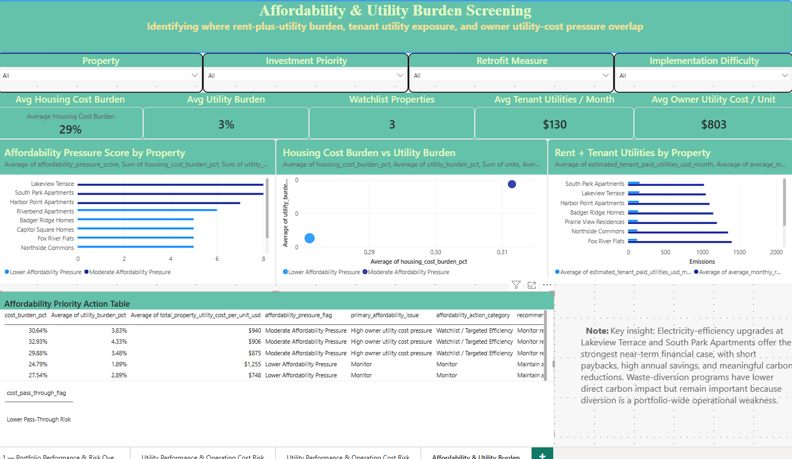

# Multifamily Portfolio Cost, Risk & Retrofit ROI Dashboard

A Power BI and Excel dashboard that connects property performance, utility-cost risk, retrofit ROI, and affordability pressure screening for multifamily housing portfolios.

## Project Overview

This project was built to show how multifamily building-performance data can support decisions beyond basic reporting. In many real estate and housing portfolios, utility bills, asset information, sustainability metrics, affordability indicators, and capital-improvement ideas are stored in separate files or systems. That makes it difficult for property managers, asset owners, housing organizations, and sustainability teams to see which buildings need attention first and which improvements are worth prioritizing.

This dashboard brings those pieces together into one decision-support workflow. Using a simulated multifamily portfolio, the project evaluates energy use, utility cost, emissions exposure, water and waste performance, retrofit financial performance, and affordability pressure. The goal is to identify properties with higher operating-cost risk, stronger retrofit needs, and potential resident affordability concerns.

The project is not designed to produce an official ESG score, GRESB submission, investment-grade audit, or tenant-level affordability determination. Instead, it demonstrates how property, sustainability, utility, retrofit, and affordability data can be translated into practical decision language: cost, risk, payback, capital planning, asset value, utility burden, and resident impact.

## Business Use Case

Property managers, asset owners, affordable housing providers, and sustainability teams often need to answer practical questions before deciding where to spend time, funding, or capital:

- Which properties are costing more to operate?
- Which buildings show higher utility-cost or performance risk?
- Which assets should be reviewed first for energy, water, waste, or operational improvements?
- Which retrofit measures have the strongest payback or value impact?
- Where do operating-cost reduction and sustainability benefits overlap?
- Which properties may also create rent-plus-utility affordability pressure for residents?
- How can capital planning improve building performance without increasing resident burden?

This project shows one way to organize those questions into a dashboard that supports both property-level and portfolio-level decision-making.

## Dashboard Pages

### 1. Portfolio Performance & Risk Overview

This page identifies which properties should receive attention first. It combines energy, water, waste, carbon, diversion, and data-readiness indicators into an internal priority score.

The purpose is not to label one building as simply “good” or “bad.” The goal is to help managers see where multiple issues overlap. A property with above-benchmark energy use, high carbon intensity, weak waste diversion, and higher operating-cost risk should rise to the top of the review list.

### 2. Utility Performance & Operating Cost Risk

This page focuses on the connection between building performance and operating cost. It compares energy use intensity, utility cost per unit, carbon intensity, and electricity versus natural gas emissions across the portfolio.

For property managers and asset owners, this page helps translate technical metrics into practical operating concerns. A building with high energy use intensity may also have higher utility costs, resident affordability implications, or future capital needs.

### 3. Capital Planning & Retrofit ROI Priorities

This page connects building-performance issues to potential retrofit actions. Measures are compared by net cost, annual savings, simple payback, emissions reduction, and estimated value impact.

This page is useful for capital planning because it separates actions that are operationally important from actions that also have a strong financial case. For example, an electricity-efficiency upgrade may reduce operating costs and emissions at the same time, while a waste-diversion program may have lower direct financial return but still address a portfolio-wide operational weakness.

### 4. Affordability & Utility Burden Screening

This page adds a resident-impact lens to the portfolio analysis. It screens properties by rent-plus-utility burden, tenant-paid utility exposure, owner-side utility cost pressure, affordable-housing profile, and retrofit cost pass-through risk.

The purpose is to identify where building-performance issues may overlap with resident affordability pressure. This is especially relevant for affordable housing providers, housing authorities, NGOs, community development organizations, and property teams that need to reduce operating costs without increasing resident burden.

## Key Metrics

- Energy use intensity
- Utility cost per unit
- Scope 1 and Scope 2 emissions
- Carbon intensity
- Water and waste performance indicators
- Waste diversion rate
- Integrated property priority score
- Retrofit net cost
- Annual savings
- Simple payback
- Cost per tCO₂e reduced
- Estimated value impact
- Housing cost burden
- Utility burden
- Tenant-paid utility exposure
- Owner utility cost per unit
- Affordability pressure score
- Retrofit cost pass-through risk

## Methodology

The project uses a layered workflow:

1. **Input data organization**  
   Asset-level information, utility data, emissions factors, benchmark assumptions, retrofit options, and affordability assumptions are organized in Excel.

2. **Performance calculations**  
   The workbook calculates energy use intensity, utility cost per unit, water intensity, waste diversion, Scope 1 and Scope 2 emissions, carbon intensity, and property-level operating-cost indicators.

3. **Integrated property prioritization**  
   Properties are ranked using an internal screening method that combines operating performance, utility use, waste diversion, carbon exposure, and data-readiness indicators.

4. **Retrofit financial screening**  
   Retrofit options are evaluated using net cost, incentives, annual savings, simple payback, emissions reduction, cost per tCO₂e reduced, NOI impact, and estimated value impact.

5. **Affordability and utility-burden screening**  
   The affordability extension evaluates rent-plus-utility burden, tenant-paid utility exposure, owner utility-cost pressure, affordable-housing profile, and retrofit cost pass-through risk. This helps identify where building-performance improvements may also support resident affordability goals.

6. **Power BI dashboarding**  
   Summary tables are imported into Power BI to create an interactive dashboard for property-level and portfolio-level decision-making.

## Tools Used

- **Excel** for data modeling, formulas, assumptions, calculation tables, and screening logic
- **Power BI** for dashboard design and visual analytics
- **DAX** for portfolio KPIs and financial measures
- **Python** for optional project organization and quality checks
- **Real estate performance analytics** for operating cost, retrofit screening, and capital-planning interpretation
- **Affordability screening logic** for rent-plus-utility burden, utility exposure, and resident-impact analysis

## Dashboard Preview

### Page 1 — Portfolio Performance & Risk Overview

### Page 2 — Utility Performance & Operating Cost Risk

### Page 3 — Capital Planning & Retrofit ROI Priorities

### Page 4 — Affordability & Utility Burden Screening

## Project Files

- `data/` — Excel workbooks with portfolio model, affordability extension, calculation tables, and assumptions
- `powerbi/` — Power BI dashboard file
- `images/` — Dashboard screenshots for quick preview
- `docs/` — Supporting documentation and marketing factsheets
- `requirements.txt` — Python package requirements for optional QA or workflow scripts

## Data Notes

This project uses simulated and screening-level portfolio data for demonstration purposes. The affordability layer uses property-level assumptions for rent, estimated tenant-paid utilities, area income, affordable-unit share, and cost pass-through risk.

The model is designed to demonstrate workflow logic, dashboard structure, and decision-support methods. It is not based on verified tenant rent rolls, household income records, subsidy compliance data, lease-level information, or engineering-grade audit results.

## Important Note

This project is not an official GRESB submission, investment-grade audit, engineering assessment, financial recommendation, or tenant-level affordability determination.

The purpose is to demonstrate how property-performance, utility, emissions, retrofit-finance, and affordability data can be structured into a practical decision-support workflow.

## Portfolio Value

This project reframes sustainability and affordability data as property-performance intelligence. The value is not only in tracking ESG metrics, but in identifying where utility costs, operational inefficiencies, risk exposure, retrofit economics, and resident affordability pressure intersect.

For property managers, the dashboard supports practical decisions around operating cost, asset prioritization, and capital planning. For sustainability teams, it provides a bridge between reporting metrics and business decisions. For asset owners, it connects performance improvements to annual savings and estimated value impact. For affordable housing and community-focused organizations, it shows where building performance and utility burden may affect resident affordability.

## Potential Use Cases

This workflow could support:

- Multifamily property performance review
- Utility-cost and operating-risk screening
- Energy-efficiency and retrofit prioritization
- Affordable housing preservation planning
- Utility-burden screening
- Rebate, grant, and weatherization targeting
- Resident-centered retrofit planning
- ESG and sustainability reporting support
- Owner, funder, or board reporting
- Community development and housing resilience planning

## Example Insights

- Lakeview Terrace and South Park Apartments were identified as priority assets from both a building-performance and affordability perspective.
- Three properties — Lakeview Terrace, South Park Apartments, and Harbor Point Apartments — were identified as affordability watchlist assets.
- Electricity-efficiency upgrades produced the strongest near-term financial case based on annual savings, payback, and estimated value impact.
- Waste-diversion improvements had lower direct carbon impact but remained important because weak diversion was a portfolio-wide operational issue.
- The affordability screen helps separate owner-side operating-cost pressure from resident-side utility and housing-cost burden.
- Recommended affordability actions focus on no- or low-pass-through efficiency upgrades, rebate targeting, and continued utility-burden monitoring.
